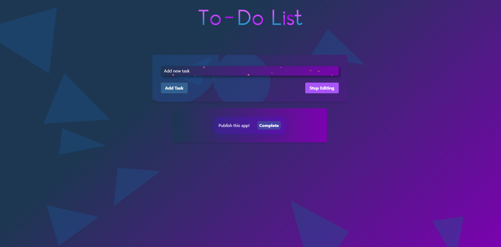

# To-Do List App

This app has a cool looking UI and is a good example of Flask and AJAX calls.

## Features

- Add new tasks
- Edit existing tasks
- Delete tasks
- Mark tasks as complete or incomplete
- Responsive design
- Modern, glassmorphic UI


## Installation

Follow these steps to set up and run the app locally:

1. **Clone the repository:**

   ```
   git clone https://github.com/barandev/todo-list-app.git
   cd todo-list-app
    ```
2. **Create a virtual environment and activate it:**
```
python -m venv venv
source venv/bin/activate  # On Windows: venv\Scripts\activate
 ```

3. **Install the dependencies:**
 ```
pip install -r requirements.txt
 ```
4. **Run the application:**
 ```
python app.py
 ```
5. **Open your browser and navigate to:**
```
http://127.0.0.1:8080
```
**File Structure**
   ```
  todo-list-app/
  │
  ├── static/
  │   ├── styles.css        # Custom CSS styles
  │   └── scripts.js        # JavaScript for interactivity and AJAX
  │
  ├── templates/
  │   └── home.html         # HTML template for the main page
  │
  ├── app.py                # Flask application code
  ├── requirements.txt      # List of Python dependencies
  └── README.md             # This readme file
 ```
Usage
- Add a Task: Enter the task description in the input field and click "Add Task".
- Edit a Task: Click the "Edit" button next to a task, modify the description, and save changes.
- Delete a Task: Click the "Delete" button next to a task to remove it.
- Complete a Task: Click the "Complete" button next to a task to mark it as complete.
- Mark as Incomplete: Click the "Incomplete" button next to a completed task to mark it as incomplete.
